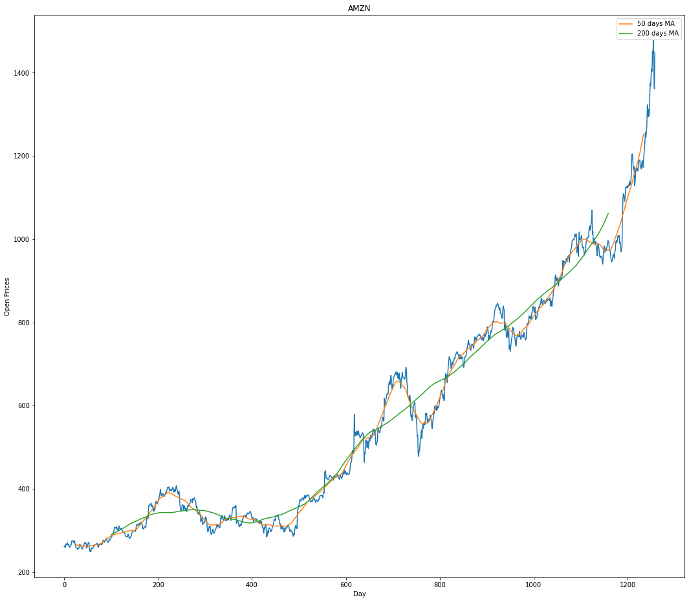
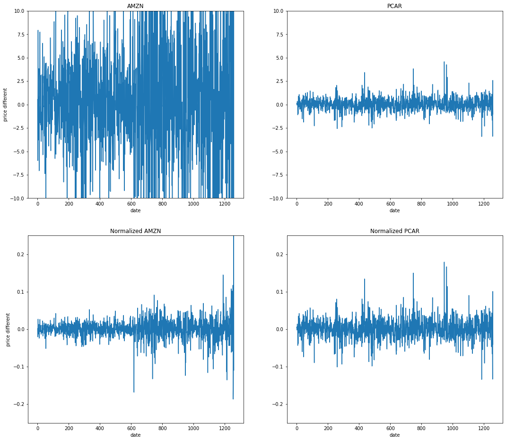
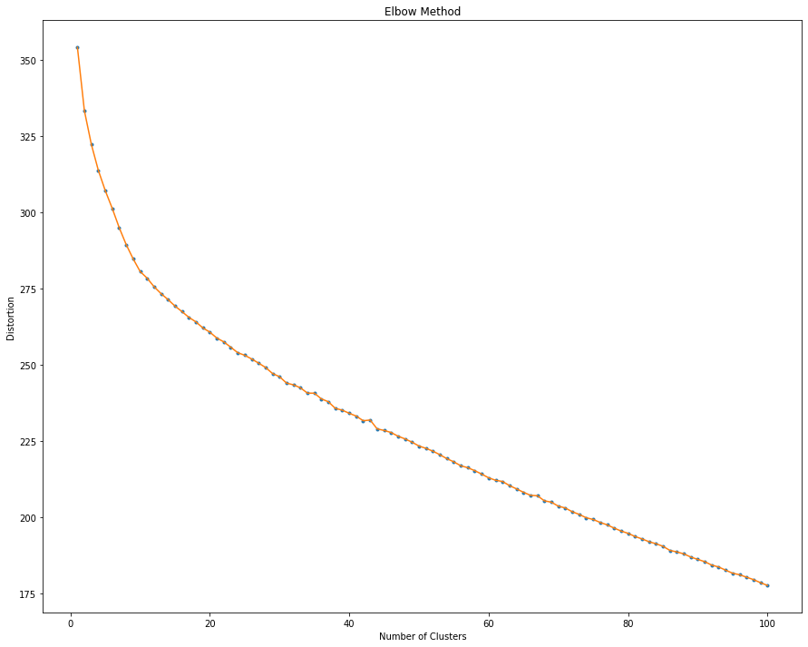
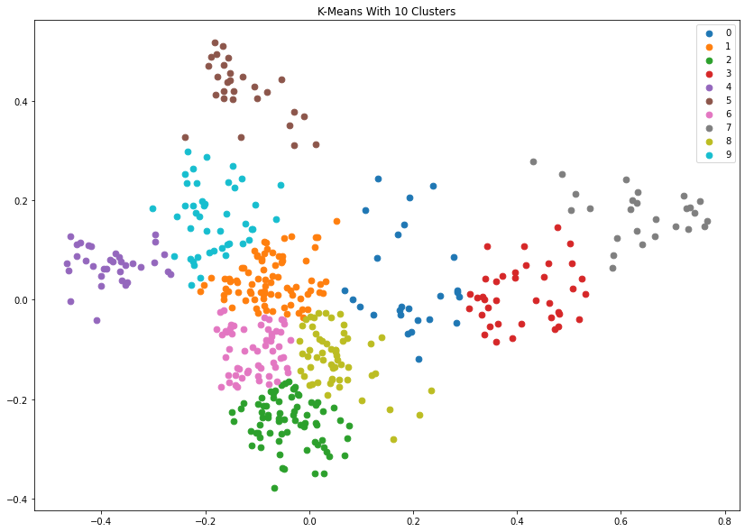
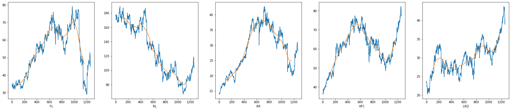
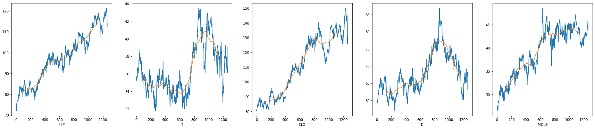

This is Group 16 project final report for 2022 Fall, CS 7641.

# Final Report

## Introduction/Background

Stock market investment requires an understanding of several metrics and indicators to make decisions about when to buy, sell, and hold. It often requires the work of many analysts evaluating factors impacting several industries and businesses. A machine learning approach enables a more efficient and robust analysis of a much larger set of data. Such algorithms can be utilized to make predictions about stock prices in advance. 

## Problem Definition

Existing machine learning models like Random Forest used to predict values of S&P500 [1] and XGBoost used to predict Vangaurd (VTI) returns [2] aim to predict changes in stock prices to assist financial decisions. However, prediction models have proven to be limited in their own way. Even so, models can be constantly trained on an ever increasing volume of data. A finely tuned machine learning model is better suited to illuminate the predictive value of historical market activity on future trends.

Given a set of numeric data about the past stock performance and text data from news outlets, by using Random forest, XGBoost decision tree models and clustering models, we aim to better fit, tune datasets and to outperform traditional prediction models.

## Data 

In our project, we used the historical stock data for all current S&P 500 companies. The data collection process is different from what we have proposed. Instead of extracting the stocks data from Yahoo finance, we have downloaded the 5 years records of S&P 500 companies stock data from kaggle.
 
We used “price change” to measure the movement of the stock price. The figure above shows an example of the plot for AMZN stock, with moving average applied.

## Methods (Unsupervised Model: KMeans)
Up till now, we normalized our dataset to format it to a standardized version and used Principal Component Analysis to reduce the amount of features in our data set, into 2 components. After preprocessing our dataset, we used unsupervised learning model KMeans to cluster different types of stocks. For each stock, we will calculate the percent change in price for each day. This gives a more meaningful comparison compared to the absolute change in daily price. Each day will correspond to a unique variable, so a single distance computation will always be done for the same corresponding day.

## Results and Discussion
### Data Cleaning and Preprocessing
The dataset contains 5 years of stock data from 505 companies. The start date is at 2013-02-08 and the end date is at 2018-02-07. We excluded the stocks that had a different start date or missing dates. The dataset has 7 features for each stock, the date, open price, highest price of the day, lowest price of the day, close price, and volume (number of shares traded). For classifying and predicting stocks, we aimed to find the difference between the close price and the open price for each stock for everyday value. 
 
After checking the data, we found that there is no empty value. Therefore, we used normalization and PCA for our data preprocessing.

Normalization of our dataset is also one important factor. If we don’t normalize all stocks data, the classification model will cluster based on price of the stock instead of the movement of stock. As you can see the plot of two stocks “AMZN” and “PCAR”. After normalization, the movements are more even and are much less noisy.
The plot above shows an example of the normalization for the data. 
 
### Principal Component Analysis
In order to reduce the number of features and to find out the most correlated features to the price, we applied PCA to the normalized data. We selected the top 2 features and checked with our algorithm. We compared the model with and without data after PCA by using silhouette score, and found that PCA significantly improved the model performance.

## KMeans Implementation
### Choose K
We used Elbow’s method to choose the K value. The figure is shown as below:

Therefore, according to the figure, we chose K=10 in our KMeans implementation.

### Clustering Results

The figure above shows the result with ten clusters in different colors.
The plots below show 10 random stocks in our ten clusters respectively within S&P 500. By looking at the price fluctuations of the stocks in the image, we can clearly see that there is a certain similarity in the cyclical movements of stocks in each cluster. 

### Evaluation
We used Silhouette score as evaluation criterion for our KMeans algorithm. 

|                   | Without PCA      | With PCA           |
|:------------------|:------------------|:------------------|
|Silhouette Score   |0.05867           |0.39538             |

Without PCA, we got a low Silhouette score for our clustering, which indicates that the object is poorly matched to its own cluster. However, we find that the Silhouette score significantly increases with PCA during our preprocessing, which means feature selection is meaningful for stock prices. 

## Contribution Table

| Group Member      | Tasks Done        |
|:------------------|:------------------|
| Dan Nguyen        |Report Writing, GitHub Page |
| Yilong Tang       |Data cleaning and preprocessing |
| Alan Yu           |KMeans implementation |
| Jiaying Li        |GitHub script, Report Writing |

## References

[1] Khaidem, L., Saha, S., & Dey, S. R. (2016, April). Predicting the direction of stock market prices using random forest.\
[2] Zolotareva, E. (1970, January). Aiding long-term investment decisions with XGBoost machine learning model.\

